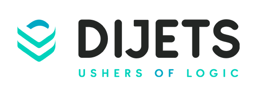

---

## Dijets - An Introduction

A wordplay on Digits, Dijets is an ecosystem of decentralised products, services, and enterprise grade distributed system frameworks built from the ground-up to fully leverage a refined iteration of the State Machine Replication system desig

## Dijets Blockchain

Dijets Blockchain is a decentralized, programmable database designed to support and serve Dijets Ecosystem and its ternary faculties of:

* **Value Management**
* **Interoperable utility**
* **Asset Tokenisation**

Central to the Ecosystem is Dijets native cryptocurrency - DJT -  developed to serve as an efficient medium of exchange for millions of people around the world. DJT will also serve as the key pre-requisite resource to interact with Dijets an

Dijets aim is to create highly scalable, friction-less and sustainable digital infrastructures that can foster innovation, lower barriers to entry, and improve access to financial, digital, and utilatarian services of today and tomorrow.

## License

Dijets NC is licensed as [Apache 2.0](https://github.com/lasthyphen/dijets/blob/main/LICENSE).
